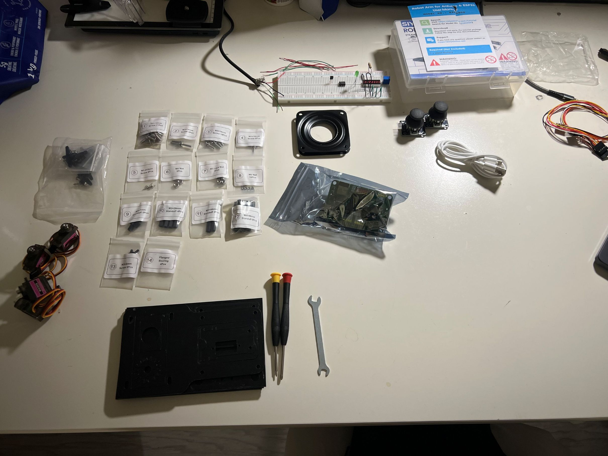
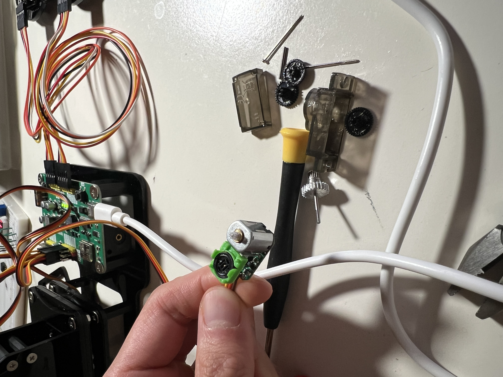
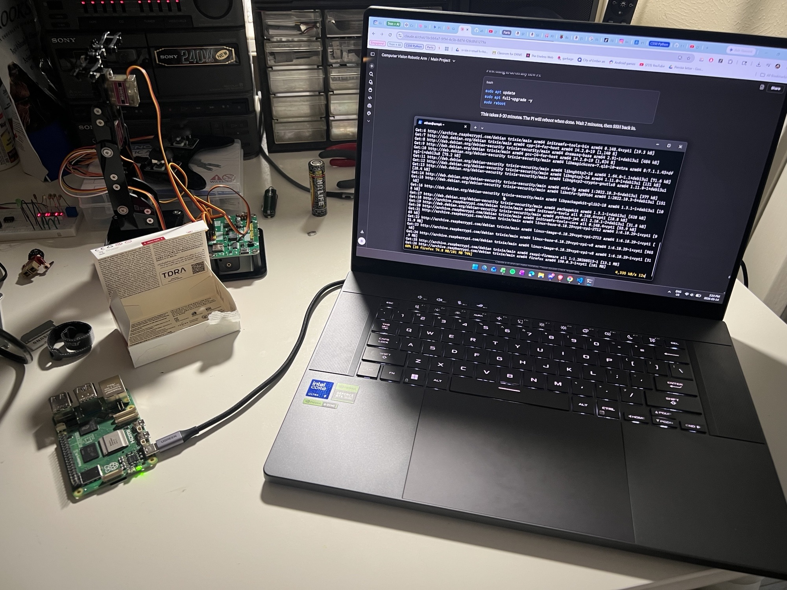
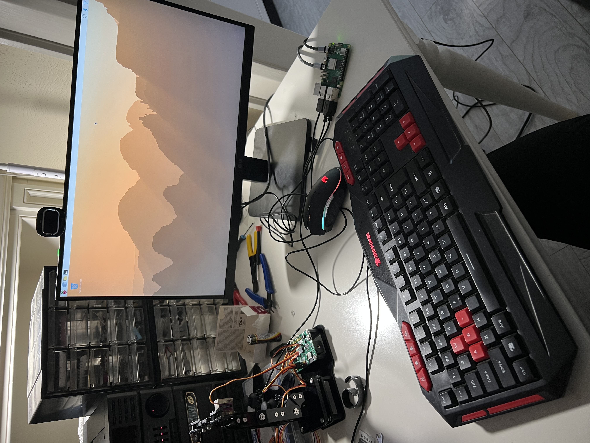

# Project Journal

## Week 0 - Planning & Repository Setup (May 3-9 2026)
**Goals**: Order parts, set up repo, finalize architecture

**Completed**: 
- Verified parts list and ordered components
- Set up Github repo

**Blockers**: None yet - waiting for parts to arrive

**Learned**:
- How to control servos using ESP32Servo library on ArduinoIDE

**Next Week**: 
- Complete repo folder structure
- Draft complete README scaffold
- Assemble robot arm frame

## Week 1 - Arm Assembly, Raspberry Pi Setup, ESP32-C3 Custom Firmware (May 10-16 2026)
**Goals**: Assemble arm frame, ensure working servos, set up Raspberry Pi, BOM

**Completed**:
- Assembled arm frame, working servos
- Raspberry Pi set up
- BOM file created
- Backed up 4MB of SIYEENOVE stock firmware
- Wrote and flashed custom firmware to ESP32-C3 (`esp32/src/serial_servo_control/`)
- Calibrated arm initial position (90/90/90/90)

**Blockers**: ESP32-C3 will not function unless 18650 battery is present due to power management integrated circuit.

**Learned**:

Arm
- The gripper servo (D) failed after being commanded to close on a rigid object. Because hobby servos have no current limiting, the control circuit drove the motor at maximum output indefinitely (stall condition), generating sustained heat. Disassembly showed the gearbox was intact, the actual failure was electrical: heat damaged the position feedback loop (potentiometer which senses commanded position and actual position or control IC), so the motor now spins continuously because the control circuit can't detect when it has reached the commanded position. Servo (MG90S) replaced.
- Calibration: adjusting servo horn mounting so that commanding 90/90/90/90 (degree of servos) places the arm in a vertical reference pose with gripper horizontal. 

Raspberry Pi
- How to set up Raspberry Pi with imager
- How to connect to Raspberry Pi remotely using SSH as well as with monitor + mouse + keyboard plugged in

ESP32-C3
- ESP32-C3 has two physically separate serial interfaces: USB Communications Device Class peripheral (accessed as 'Serial') and legacy hardware UART0 (accessed as 'Serial0'). The SIYEENOVE dev board has an unconventional USB-C connection. The USB-C connector is routed to UART0 via an onboard USB-to-UART bridge as opposed to the native USB peripheral, leaving the native USB peripheral electrically disconnected. As a result, 'Serial.println()' in user code transmits into a dead end, while Serial0.println() reaches the host. Switching all serial calls from 'Serial' to 'Serial0' resolved the issue completely.
- Diagnostic Path: identical failure in both Arduino IDE Serial Monitor and a direct pyserial miniterm session ruled out the IDE as the cause. Claude identified the distinct serial interfaces on the ESP32-C3 and provided troubleshooting steps to identify the connection discrepancy. 

**Next Week**:
- Define and document safe angle ranges for all servos - implement angle bounds to prevent stall-induced servo damage like servo D
- Begin Pi-side serial communication module (follows ESP32 firmware serial command format, error handling,...) via Python
- Computer vision basic understanding and integration

## Week 2 - Raspberry Pi to ESP32 communication (May 17-23 2026)
**Goals**: Define safe joint angles, add joint limits to firmware, Pi-side ArmController class

**Completed**:
- Serial commands from Pi to ESP32 via python3 in Pi terminal
- ESP32-C3 firmware update to implement servo easing
- Tested per-joint absolute mechanical limits
- ESP32-C3 firmware update to include absolute joint limits with a 5° safety margin
- Successful Pi to ESP32 serial communication using Python script
- Created new Github testing branch for Pi files

| Joint | Label | Absolute Range (degrees) | Range w/ Safety Margin |
|-------|-------|-----------------|---------------------------------|
| Base | S1 / Servo A | 0 - 190 | 5 - 185 |
| Shoulder | S2 / Servo B | 0 - 160 | 5 - 155 |
| Elbow | S3 / Servo C | 0 - 190 | 5 - 185 |
| Gripper | S4 / Servo D | 15 - 120 | 20 - 115 |

**Blockers**: No significant blockers noted during times of building

**Learned**:

Arduino IDE
- A "conflicting declaration" compilation error during this session turned out to be caused by multiple .ino files in the same sketch folder; Arduino IDE compiles every .ino in a folder as one program, so leftover old versions caused duplicate symbol errors. Reorganizing into one .ino per folder with old versions moved to old_sketches/ resolved it.

Arm
- Discovered shoulder servo (C) would oscillate when reaching its vertical reference position from a compact position. Oscillation would persist on battery-only power (ruling out USB power sag), and could be stopped by light finger pressure on the arm (likely ruling out electrical feedback loop internal to servo). The most plausible explanation is mechanical resonance in the acrylic frame being excited by the end-of-motion deceleration impulse, with the servo's position corrections reinforcing rather than damping the oscillation, though this wasn't definitively confirmed.
- Smooth motion was implemented using the ServoEasing library (v3.6) rather than hand-rolling. Implemented EASE_QUARTIC_IN_OUT at 30 deg/sec for gentle end-of-motion deceleration. This eliminated oscillation in all tested poses so far. 

Raspberry Pi & Python
- Built Pi-side serial communication layer (utilizing Claude): a python `ArmController` class that wraps the ESP32 serial protocol, validates joint angles against the same per-joint limits as the firmware (defense in depth), parses `OK`/`ERR` responses, and raises typed exceptions (`OutOfRangeError`, `FirmwareError`) on failure. The class isolates _all_ serial behind a clean move_to(base, shoulder, elbow, gripper) API so the rest of the project - vision, kinematics, pick-and-place - doesn't need to know the underlying protocol. This makes it easier to refactor to different forms (ex. serial to Wifi/MQTT).
- Smoke test (`test_arm_controller.py`) exercises the happy path (ideal workflow, home-compact-home), Python-side validation (commanding an out-of-range angle and catching the exception), and context-manager cleanup (setup and cleanup and explicit release).
- This architecture sets up a layered design: ArmController is lowest Pi-side layer, with future modules (vision detector, kinematics, calibration, trajectory planner, main.py as orchestrator) stacking above it, each only depending on layer below.

Git & Github
- Python code for Pi were implemented on a feature branch rather than `main` to keep the main branch stable.
- Utilized `git stash` command to tuck away added files on laptop VS Code. The branch was created on GitHub website (a copy of main), fetched locally with `git fetch origin`, checked out, and the stash popped to bring back the files back on the new branch where they were then committed and pushed. The Pi was then switched to the same branch via `git fetch origin` + `git checkout`, which made the new code available for testing on hardware.

Debugging
- Testing surfaced two bugs in the test script and class, each caught by isolating layers and working from bottom up.
- A bare-metal serial test (raw pyserial called outside the class) confirmed the hardware-adjacent layers - port, firmware, etc. - were all working, which narrowed the problem to Python-side code.
- First bug was a logic which was fixed easily `if __name__ == "main":` (missing double underscores)
- Second bug was a runtime error (specifically TypeError), a misuse of pyserial's `is_open` (a property, not method) inside the `close()` method, which crashed during context-manager cleanup after the test had otherwise passed.
- Both bugs were fixed and test sequence runs end-to-end
- Key Takeaway: when "nothing happens" is the symptom, testing each layer in isolation from the bottom up can be more efficient than reading code top-down

**Next Week**: working detection of objects using camera and OpenCV

## Week 3 - Computer Vision Basics (May 24-30 2026)
**Goals**: Working detection of objects of certain colours, decide more permanent camera placement? (start organizing setup board?), tune threshold for accuracy, determine shape and colour of 3d printed objects for demo and training

**Completed**:
- Created new feature branch for OpenCV testing and implementation
- Successful first run of object detection based on colour on Pi using camera and OpenCV
- Working HSV tuner

**Blockers**: No significant blockers noted during times of building

**Learned**:

Git & Github
- Utilized 'merge' feature for first time. Merged feature branch 'Pi-ESP32-serial-comm-test-1' with main. 

OpenCV
- Utilizing HSV Thresholding instead of native BGR from OpenCV. Refer to section 'HSV vs. BGR' in `OpenCV & Numpy` in pi README.
- Different lighting and backgrounds can cause HSV ranges for colours to shift, so implementing `hsv_tuner.py` script lets you actively find the ranges first then manually change the colour ranges in `object_detector.py`
- Red is unique and needs two ranges for hue due to OpenCV's 8-bit image capacity (only supports up to 256 unique values when colour wheel is 360 degrees). OpenCV decided to divide hue value by 2 so that all colours can fit in one byte, thereby condensing hue to 0-179 inclusive where each unit represents two degrees. Red sits at the top of the colour wheel so its seeps into both ranges. That's why red needs to be accounted for in both the lower (arorund 0) and upper (around 179) range! 

**Next Week**:

## Week 4 - Kinematics (May 31-June 6 2026)

**Learned**:

Forward Kinematics
- Answers the question: Given angles of all joints, where is the gripper in 3D space?

Inverse Kinematics
- Answers the question: Given a position in 3D space, what are the angles of all joints?

## Week 5, 6 - Sprint Restart: Revising Code, Implementing ikpy, 3D Printing (August 14-August 23 2026)

**Goals**: Recover project state after gap, replan for 2-week hard deadline, revise & update pi code where needed, learn and implement ikpy library, design and print objects for pick-and-place sequence, implement functional end-to-end main.py, tune pipeline for consistent single-object picks, extend to multi-object with physical drop contianer, characterize real-world reliability

**Completed**:
- Replanned remaining scope into 14-day MVP (minimally viable product) sprint; dropped all stretch goals, switched IK approach from closed-form to ikpy
- Designed, sliced, and printed first pick-and-place object (22mm diameter cylinder, engraved initials)
- Built accurate kinematics model
- Physically fixed arm and camera to keep constant relative pose
- Calibrated arm using 6 test points on the physical board with minimal error
- Implemented main.py for one object, bringing together all modules in this project (vision, kinematics, serial communication to esp32)
- Tuned pipeline for reliable object pickup
- Improved main.py for multiple objects
- Ran reliability characterization: 11 runs of 3 objects each, aggregate 30/33 pick success rate (~91%)

**Blockers**: None outstanding by today (August 23)
- Grip too was lose one first run of main.py (fixed by both a wider cylinder and tighter close angle)
- Arm was undershooting objects farther away (fixed by implementing reach compensation)
- Objects in drop-off box being re-picked as new targets (fixed by world-coordinate exclusion mask)

**Learned**:

3D Printing
- Cylinder chosen over cube specifically because a cube's effective grip width changes with rotation (face width vs. diagonal). A cylinder presents a constant width regardless of rotation

Camera-to-arm calibration (Homography)
- A homography maps points between two flat planes, this is ensured by having the camera completely stationary for all pictures with a top-down view
- Calibration is the translator/connector between the camera's pixel coordinate with the arm's measurements to a point in the real world

Motion Timing
- When testing single object pick-and-place sequence, the arm visibly interrupts one motion mid-transit to begin the next
- `move_to()` returns as soon as the firmware acknowledges (starts easing), NOT when motion completes. Sleep duration after `move_to()` are the actual gate on when the next command can be issued
- ServoEasing's `EASE_QUARTIC_IN_OUT` (Arduino library) dominates every move's total time. A variable `SETTTLE = 1.5` gives an ample buffer between movements to complete end-to-end without cut-off

Reliability Characterization
- Aggregate: 30/33 successful picks and drops (~91% success rate)
- Failure breakdown: 4 failures, 3 of them the same cascading root cause (initial pick disturbance either pushes a neighbouring object out of reach, or fails to grip a too-close object and knocks it further away, and then that object stays unreachable for the rest of the run)

Claude
- Claude (amongst other AI models) can often make assumptions and interpretation mistakes and provide results that do not align with the user's intent. This is inevitable but can become prominent in a dense project such as this. That's why constant double-checking and clearly defined objectives will optimize the behaviour of the model. Often easier said than done as users tend to make many assumptions on the behaviour of the model itself.

**Future Improvements / Implementations**:
- Graceful skip on `UnreachableTargetError` (currently crashes the run; should log and continue with remaining pickable objects)
- Minimum-pick distance rule to skip targets that are too close and that geometry can't grip cleanly
- Multiple colours with matched-colour containers (sorting)