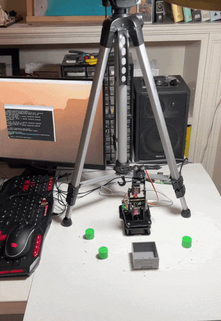

# Computer Vision-Controlled Robotic Arm
A 4-DOF robotic system that uses computer vision to detect and pick-and-drop objects autonomously. Built as a personal project May-August 2026.

**Status**: Complete - full pipeline working end to end, ~91% pick success rate across reliability testing.

<!--  -->


## What it does
 
Point the camera at a table with coloured objects on it, run `main.py`, and the arm will find each object, work out how to reach it, pick it up, and drop it in a container — then go back for the next one, until the table is clear.
 
Under the hood: a Raspberry Pi 5 runs OpenCV to detect objects and locate them in the real world, uses inverse kinematics to compute the joint angles that reach each one, and streams those angles over serial to an ESP32-C3 that drives the four servos with smooth, resonance-free motion.

## How it works
 
```
  Camera ──▶ Raspberry Pi 5 ──────────────▶ ESP32-C3 ──▶ 4× MG90S servos
            • detect object (OpenCV/HSV)     • parse command
            • pixel → world (homography)     • validate joint limits
            • solve joint angles (ikpy)      • smooth easing → PWM
                        │  S1:x,S2:x,S3:x,S4:x  ▲
                        └───────── USB serial ──┘
```
 
The two sides have a clean split: the Pi does all the sensing and thinking, the ESP32 does all the real-time motor control. They talk over a simple text protocol (`S1:<angle>,...` with `OK`/`ERR` replies), which keeps each side independently testable.

## Hardware
 
- **Raspberry Pi 5 (4GB)** — vision, kinematics, orchestration
- **ESP32-C3 (SIYEENOVE dev kit)** — real-time servo control
- **4× MG90S micro servos** — base, shoulder, elbow, gripper
- **Microsoft LifeCam HD-3000** — workspace camera
- **18650 Li-ion battery** — servo power
- **3D-printed cylinders** — the pick-and-place objects
Full parts list and prices in [BOM.md](BOM.md).

## Repository layout
 
```
├── esp32/        Firmware, flashing guide, serial protocol   → esp32/README.md
├── pi/           Vision, kinematics, calibration, main loop   → pi/README.md
├── BOM.md        Bill of materials
├── JOURNAL.md    Week-by-week build log
└── LICENSE       MIT
```
 
The two sub-READMEs are where the real detail lives:
- **[pi/README.md](pi/README.md)** — the software stack, architecture, and the vision/kinematics/calibration concepts.
- **[esp32/README.md](esp32/README.md)** — flashing the firmware, the serial protocol, and board-specific gotchas.

## Highlights
 
A few of the more interesting problems solved along the way (the full story is in [JOURNAL.md](JOURNAL.md)):
 
- **Diagnosed a dead-end serial port.** The SIYEENOVE board routes USB-C through a UART bridge to `Serial0`, not the ESP32-C3's native `Serial` — so the obvious code silently transmitted into nothing until the two interfaces were traced apart.
- **Killed a servo, then designed the fix in.** An early stall burned out the gripper servo (hobby servos have no current limiting). That incident drove per-joint software *and* firmware limits with safety margins.
- **Traced a shoulder oscillation to mechanical resonance** in the acrylic frame, not electronics, and damped it with easing profiles instead of chasing an electrical ghost.
- **Characterised real-world reliability** — 11 runs, 30/33 picks, with the failure modes documented rather than hidden.

## Project journal
 
[JOURNAL.md](JOURNAL.md) tracks the build week by week — goals, what got done, what broke, and what each week taught. It doubles as the honest record of how the project actually went, dead ends included.
 
---

_Notes: Claude was used to help coordinate the big-picture pipeline, brainstorm the repo structure, and work through debugging. Assembly, firmware, integration, and hardware work was done independently._