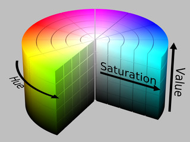

# Overview
The Raspberry Pi 5 4GB handles

Table of Contents
- [OpenCV & NumPy](#opencv--numpy)

## OpenCV & NumPy
Open Source Computer Vision Library (**OpenCV**), is an open-source software library designed specifically for real-time computer vision, image processing, and machine learning.\
Numerical Python (**NumPy**), is the foundational open-source library for scientific and numerical computing in Python.

When OpenCV reads a frame from the camera, it gives you a NumPy array — a grid of numbers.
For a 640x480 colour image, that array has shape (480, 640, 3):
- 480 rows (height)
- 640 columns (width)
- 3 values per pixel (colour channels)

Each pixel is represented by three numbers. By default, OpenCV uses **BGR oder** (Blue, Green, Red). All values range from 0-255.

HSV vs. BGR

## Why HSV and not BGR?

BGR can vary greatly under lighting changes. Under bright light, a red block may have BGR values [30, 20, 200]. Under dim light, the same block might look like [15, 10, 100]. If you try to write "detec red = R channel between 150 and 255", your detection breaks in lighting variance — or you risk losing colour detection accuracy if your range is too large.
The reason: in BGR/RGB, brightness and colour are mixed together in all three channels simultaneously.

With HSV, mostly V changes (brightness) when lighting changes and slightly S (Saturation). H stays roughly the same. So a red block under bright vs. dim light has nearly the same H value, just different V. This lets you write a detector saying "find pixels where H is between 0 and 10 regardless of V" and it will work across lighting conditions. 
| HSV | Description |
|-|-------------|
| Hue | The *pure* colour — what we normally call 'red', 'green', 'blue', etc. Represented as an angle on colour wheel. In OpenCV hue goes from 0-179. |
| Saturation | The intensity or *vividness* of a colour. High saturation = vivid, pure colour. Low saturation = washed out, closer to grey. Range 0-255 in OpenCV. |
| Value | How *bright* the colour is. High value = bright. Low value = dark. Range 0-255 in OpenCV. |

\
**Figure 1: Cylindrical representation of HSV**

Converting BGR to HSV in python only takes one line!\
hsv = cv2.cvtColor(image, cv2.COLOR_BGR2HSV)

Frame Pipeline

## Frame Pipeline — How does each frame get processed?

**Raw frame (BGR)**

↓ cv2.cvtColor(image, color conversion) — converts BGR to HSV

**HSV frame**

↓ cv2.inRange(src, lower bound, upper bound) — performs thresholding to see if colour is in range (returns binary image in black and white)

**Raw masks (noisy)**

↓ morphologyEx OPEN → erode then dillate (removes small isolated noise pixels)\
↓ morphologyEx CLOSE → dillate then erode (fills small holes inside deteced regions)

**Clean masks** 

↓ cv2.findContours → list of contour boundaries (boundaries of objects in a binary image)

**Contours**

↓ filter by cv2.contourArea < MIN_CONTOUR_AREA (min contour area is arbitrary and should be tested)

**Real contours** 

↓ cv2.boundingRect → (x, y, w, h)\
↓ cv2.moments → (cx, cy) (centroid, expand later)

**DetectedObject instances**

↓ draw() → annotatetd frame

**Display**

[Back to top](#overview)